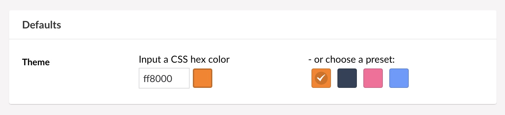
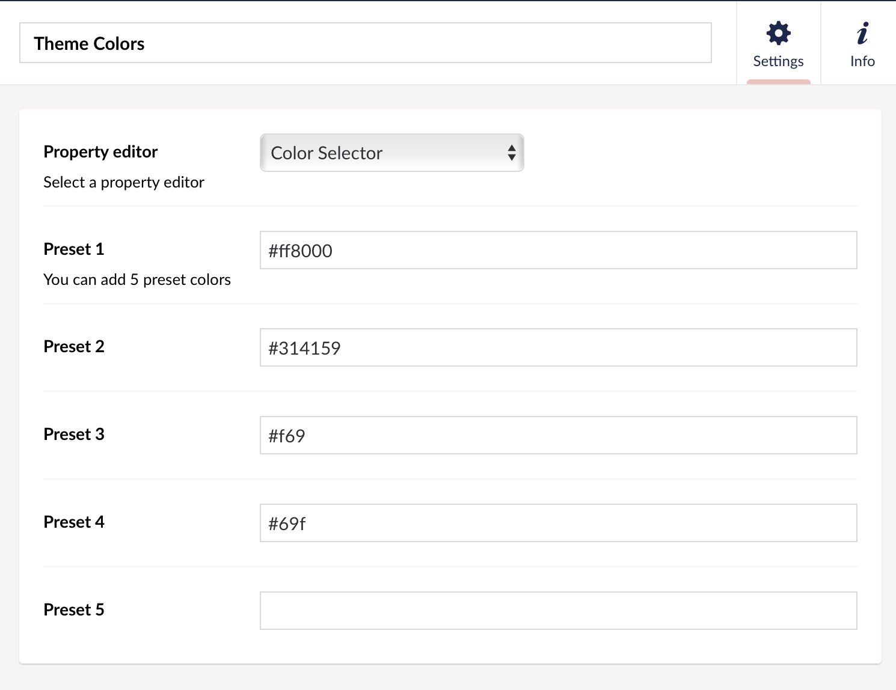

# Color Selector for Umbraco

A Property Editor for selecting a color - either by picking from a few defaults
or by providing a specific CSS color value.

Currently allows for 5 presets (per datatype).

## Versions

- Version 1.x (Umbraco package) works in Umbraco 7 and Umbraco 8
- Version 3.x (Nuget package) works in Umbraco 10 (with .net6) and Umbraco 11 (.net7)

There is no package for Umbraco 9, as I am not able to test that configuration.

Note that you'll need to manually download the appropriate _PropertyValueConverter_
for version 1.x, depending on which Umbraco version you have.

The Nuget package installs the PropertyValueConverter automatically.

## Screenshots

### Property editor

### Configuration

## Building

Running the `build.sh` script (on macOS) builds a ZIP file in the `dist` folder which
should be installable from Umbraco 8's _Packages_ section or
Umbraco 7's _Developer > Packages_ section.

The `nuget-build.sh` script is what I use to build the Nuget package.
